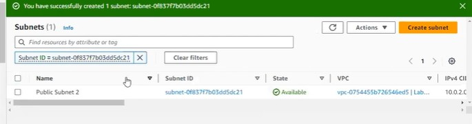
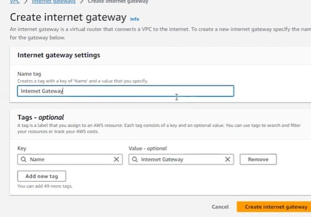
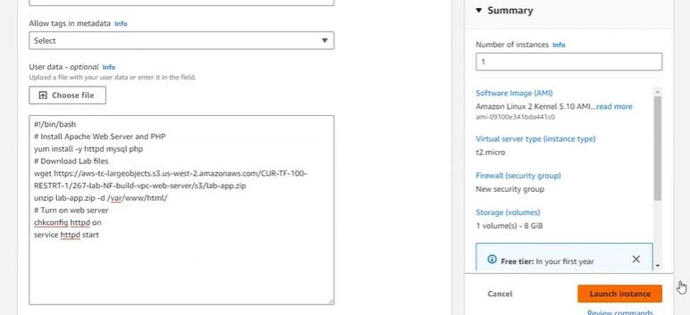

# Build Your VPC Launch a Web Server Lab

## Objectives

- Create a virtual private cloud (VPC)
- Create subnets
- Configure a security group
- Launch an Amazon Elastic Compute Cloud (Amazon EC2) instance into VPC.

## Steps Taken

- Logged into AWS Management Console.

- Used the VPC Wizard to create a new VPC with one public and one private subnet.

- Attached an Internet Gateway and created a NAT Gateway for outbound traffic from the private subnet.

- Created additional subnets in a second Availability Zone for high availability.

- Configured route tables for both public and private subnets.

- Created a security group allowing SSH (22) and HTTP (80) access.

- Launched an EC2 instance in the public subnet using Amazon Linux.

## Challenges

- EC2 instance was not reachable at first because HTTP port (80) wasn’t open.

- Fixed by adding an inbound rule for HTTP in the security group.

- NAT Gateway didn’t work initially — resolved by associating the correct private route table.

## Sceenshots

Bellow is the pictures taken durring the lab: 

## Takeaways

- VPCs define private networks within AWS.

- Subnets separate public and private resources.

- Route tables control how traffic flows between subnets and the internet.

- Security groups act like firewalls — always verify port rules.

- Multi-AZ setup improves availability and fault tolerance.
