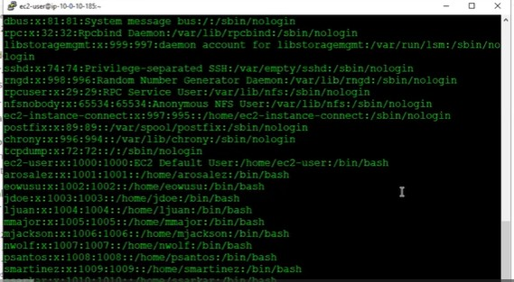
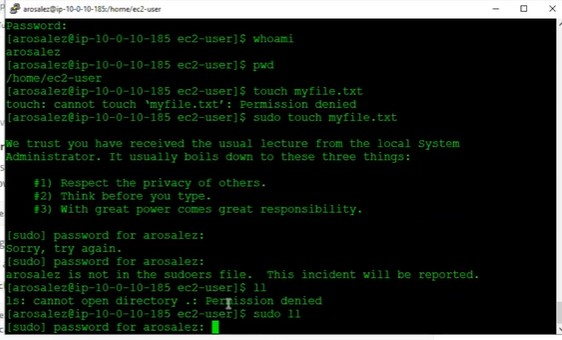
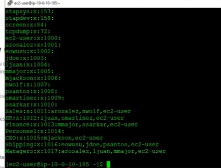

# Managing IAM Users and Groups lab

## Objective

Learn how to create IAM users and groups, assign permissions, and apply the principle of least privilege.

## Steps Taken

- Opened the IAM Management Console.

- Created IAM users and their passwords

- Created new groups: Finance, Sales, HR, Managers, CEO, Shipping and Personnel.

- Attached AWS managed policies to groups.

- Assigned each user to the relevant group based on their department.

- Verified group permissions by logging in with each user’s credentials

## Challenges & Resolutions

- Forgot to attach permissions to groups, which caused access denied errors.
    - Resolved by reviewing the group policies and attaching the correct AWS managed policies. 

- Misplaced a user in the wrong group, which limited their permissions.
    - Resolved by removing the user from the incorrect group and reassigning them to the correct one.

## Screenshot

Bellow are the screenshots taken when doing labs.

## Takeaways

- Groups make managing permissions for multiple users easier and more secure.

- Always use least privilege principle — give only the permissions necessary.

- Proper organization of users into groups helps enforce company-wide access control effectively.

