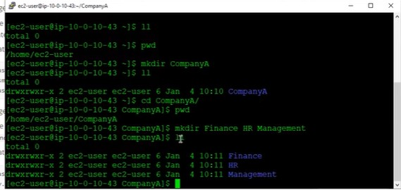
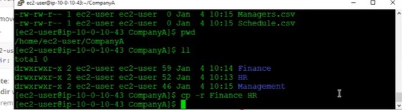
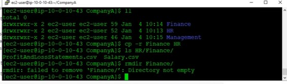

# Creating and Managing File Structures on EC2

## Objective

Learn how to create and organize a folder structure within an EC2 instance to simulate company data management using AWS storage concepts.

## Steps Taken

- Launched an Amazon Linux EC2 instance.

- Connected to the instance using SSH.

## Challenges and Resolutions 

- Initially forgot to use the -p flag when creating nested directories.

- Accidentally named a file incorrectly; resolved it using the mv command to rename.

- Learned how to use the tree command for visual verification of directory structure.

## Screenshot

Below are the screenshots taken during the lab:

## Takeaways

- Gained experience in managing file systems within an EC2 instance.

- Understanding  how Linux directories can simulate departmental data organization in AWS.

- Also learn the  best practices for creating and verifying file structures efficiently.
- It is imposible to remove a file with content inside, to remove a file it should be empty. 