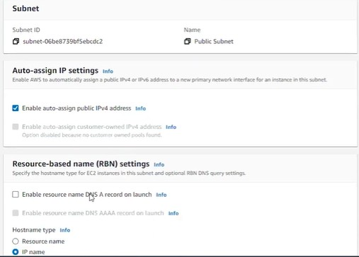
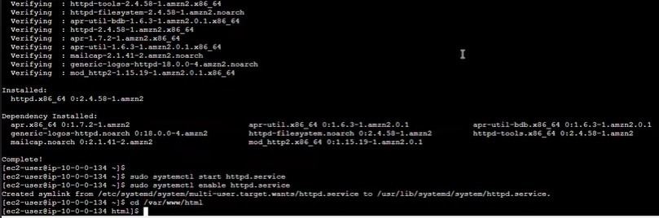

# Launching an EC2 Instance lab

## Objective

Learn how to:

- Configure a Virtual Network (VPC)

- Launch an Amazon Linux EC2 instance within that network

- Install a web server and deploy a simple HTML page

## Steps Taken

- Logged into the AWS Management Console.

- Created a new VPC and subnet to host the EC2 instance.

- Launched an Amazon Linux AMI instance.

- Configured Security Groups to allow SSH and HTTP.

- Added user data during launch to install Apache (httpd) and start the web service automatically.

- Used EC2 Instance Connect to verify installation.

- Created a simple HTML page.

- Accessed the public IPv4 address to confirm the webpage loaded successfully.

## Challenges and Resolutions 

- Initially, forgot to configure inbound rules for HTTP (port 80), which caused connection timeouts.

- The Apache service failed to start due to missing permissions.

    - Resolved by updating file permissions using chmod and restarting the httpd service.

    - Learned to check EC2 system logs and use the AWS console monitoring tools for troubleshooting.

## Screenshots

Below are the screenshots taken during the lab:

## Takeaways

- EC2 instances require proper network configuration (VPC, subnets, security groups) before they can communicate.

- Always ensure ports 22 (SSH) and 80 (HTTP) are open when hosting web servers.

- AWS makes it easy to deploy and test web applications in isolated environments.